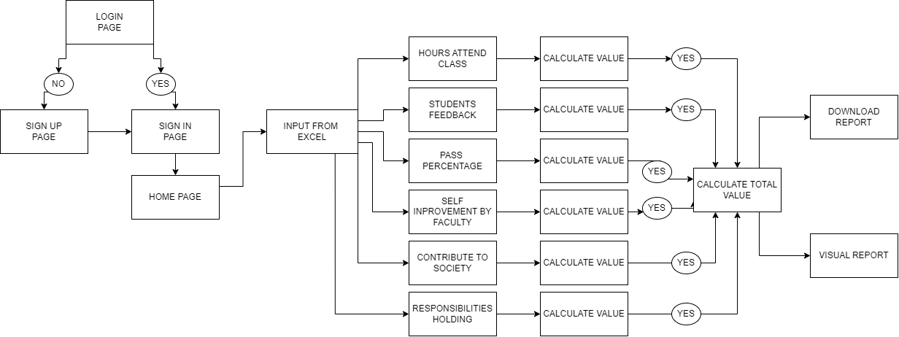

# Secure Mobile Banking & Instant Transaction Monitoring System - Backend

Spring Boot backend project for secure digital banking operations and real-time transaction monitoring.

## Tech Stack

- Java 17
- Spring Boot 3.3.5
- Spring Web
- Spring Validation
- Spring Boot Actuator
- Maven

## Prerequisites

- Java 17+
- Maven 3.9+

## Run Locally

```bash
mvn clean spring-boot:run
```

The application starts on `http://localhost:8080` by default.

## Build

```bash
mvn clean package
```

## Test

```bash
mvn clean test
```

## Core API Endpoints

- `GET /api/v1/health`
- `POST /api/v1/auth/login`
- `GET /api/v1/accounts/summary/{customerId}`
- `POST /api/v1/transactions/transfer`
- `GET /api/v1/monitoring/risk?transactionId=...&amount=...&channel=...`

## Health Check

```bash
curl http://localhost:8080/api/v1/health
```

## Module Process Flow / Design



The diagram shows the end-to-end user and processing flow for the module, from login/authentication through calculation, scoring, and report generation.

## User Stories / Requirements Specification

### User Stories

- As a customer, I want to log in securely so that I can access my account and transactions.
- As a customer, I want to view account summaries so that I can quickly understand balances and recent activity.
- As a customer, I want to transfer funds so that I can complete instant transactions safely.
- As a monitoring analyst, I want risk scoring for each transaction so that suspicious activity can be identified immediately.
- As an administrator, I want service health visibility so that I can verify backend availability and diagnose incidents.

### Functional Requirements

- FR-1: The system shall authenticate users before protected API access is granted.
- FR-2: The system shall expose account summary data by customer identifier.
- FR-3: The system shall execute transfer requests with input validation.
- FR-4: The system shall evaluate transaction risk using transaction context (amount, channel, and metadata).
- FR-5: The system shall provide health and actuator endpoints for operational monitoring.

### Non-Functional Requirements

- NFR-1: API responses for core read endpoints should remain consistently low-latency under normal load.
- NFR-2: Validation and error handling must prevent malformed or unsafe request processing.
- NFR-3: Logging and monitoring data should support auditability and incident analysis.
- NFR-4: The backend must be buildable and testable with Java 17+ and Maven 3.9+.

See `COMPONENTS.md` for the Component/Module/Microservices developed.
